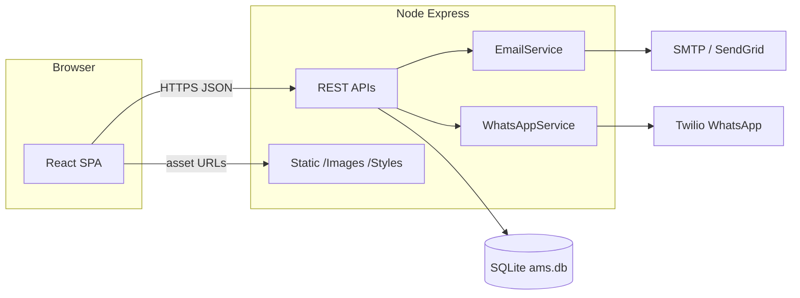

# Product Requirements Document (PRD)

## Alpha Model’s International School — Admission Management System (AMS)

**Document type:** Product Requirements Document  
**Audience:** Leadership, investors, engineering, admissions operations  
**Stack reference:** React (Vite) SPA, Node.js + Express, SQLite, Twilio WhatsApp, SMTP/SendGrid email  
**Revision:** 1.0  

---

## 1. Product overview

AMS is a web platform that supports **prospect discovery**, **program information**, and **admission inquiry capture** for Alpha Model’s International School. The public experience combines a marketing site, an online inquiry form, and a lightweight FAQ assistant. The backend persists inquiries, exposes operational APIs, and triggers **staff-facing** notifications through WhatsApp and email integrations.

**Value proposition**

- Reduces friction for parents researching the school and expressing interest.
- Centralizes structured inquiry data for follow-up.
- Automates alerting so admissions staff can respond within defined SLAs.

---

## 2. Objectives & success metrics (OKRs)

### OKR set A — Inquiry capture & quality

| Objective | Key results (examples) |
|-----------|------------------------|
| Grow qualified inquiries | **KR1:** +25% submission volume QoQ (seasonally adjusted). **KR2:** ≥ 90% submissions with valid phone + email. |
| Improve response readiness | **KR1:** 100% of stored inquiries include unique reference ID. **KR2:** Median staff acknowledgment ≤ 48 business hours (process metric). |

### OKR set B — Reliability & trust

| Objective | Key results |
|-----------|-------------|
| Stable, trustworthy digital presence | **KR1:** ≥ 99.5% monthly API success rate (excluding third-party outages). **KR2:** Zero P1 security incidents (credential leaks, data exposure). |
| Operational clarity | **KR1:** Health check + monitoring on `/api/health`. **KR2:** Documented RTO/RPO for SQLite backup strategy. |

### OKR set C — Experience

| Objective | Key results |
|-----------|-------------|
| Frictionless parent UX | **KR1:** Mobile completion rate within 5% of desktop. **KR2:** Form validation errors < 10% of submissions. |

---

## 3. User personas

| Persona | Needs | Pain points addressed |
|---------|--------|------------------------|
| **Prospective parent** | Clear school story, fees/location/process, easy inquiry | Scattered info, unclear next steps |
| **Admissions coordinator** | Structured leads, alerts, reference IDs | Manual data entry, missed leads |
| **School leadership** | Brand-consistent site, trustworthy comms | Fragmented tools |
| **Engineering / IT** | Maintainable codebase, env-based config, observability | Hard-coded secrets, tight coupling |

---

## 4. User journeys

### 4.1 Discover → understand → inquire

1. Parent lands on **Landing** (hero, grades served, location cue).
2. Parent navigates to **Main** for narrative content (mission, vision, gallery).
3. Parent opens **Enroll** (or CTAs) to submit child grade + contact details.
4. System returns **reference number**; staff receives notifications per configuration.

### 4.2 Self-service FAQ

1. Parent opens **AMS Assistant** widget on supported pages.
2. Parent asks about admissions, fees, location, or process.
3. System returns FAQ-based answer or fallback guidance with official contact channels.

### 4.3 Operations / analytics (API consumers)

1. Internal tool or script calls **`GET /api/enroll/stats`** for funnel counts.
2. Future admin UI consumes list/search endpoints (roadmap).

---

## 5. Features

### 5.1 Frontend (React SPA)

| Feature | Description |
|---------|-------------|
| **Landing page** | Marketing hero aligned with legacy `login.html` intent; CTA to main site. |
| **Main page** | Long-form content, dual carousels (hero + track), anchors for About/Contact. |
| **Enroll page** | Controlled form, client-side UX parity, server validation surfaced. |
| **Navbar** | Variants for landing / main / enroll; React Router links. |
| **Chatbot** | Floating assistant; quick actions; message list state; FAQ API integration. |
| **Configuration** | `VITE_API_BASE_URL`, `VITE_ASSET_BASE_URL` for split deployments. |

### 5.2 Backend (Express)

| Feature | Description |
|---------|-------------|
| **Enrollment API** | Validates and stores applicant; async notifications. |
| **Chatbot API** | Keyword/FAQ routing over curated content. |
| **Stats API** | Aggregate counts by status and time windows. |
| **Health API** | Liveness metadata (timestamp, environment, frontend mode). |
| **Static assets** | Images and legacy folders remain served for compatibility. |
| **SPA hosting** | When `client/dist` exists, Express serves the React build and SPA fallback. |

---

## 6. System architecture

**Deployment models**

- **Development:** Express on `:3000`, Vite dev server on `:5173` with proxy to API/assets.
- **Production (single host):** Build React to `client/dist`; Express serves API + static SPA + images.

---

## 7. API specifications

### 7.1 `POST /api/enroll`

**Purpose:** Create applicant record and trigger notifications.

**Request (JSON)**

- `parent_name` (string, required)
- `email` (string, required, email format)
- `phone` (string, required, 10–15 digits, optional leading `+`)
- `city` (string, required)
- `grade` (enum: `kg`, `1`…`7`, required)
- `message` (string, optional, ≤ 1000 chars)

**Responses**

- `200` `{ ok: true, message, reference_number, applicant_id }`
- `400` `{ ok: false, error, details?: [...] }` (validation)
- `500` `{ ok: false, error }`

**Side effects:** Insert row in `applicants`; best-effort WhatsApp + email (non-blocking for HTTP success).

### 7.2 `POST /api/chatbot`

**Request:** `{ "message": string }`  
**Response:** `{ ok: true, answer, question }`  
**Errors:** `400` / `500` JSON.

### 7.3 `GET /api/enroll/stats`

**Response:** `{ ok: true, stats: { ...aggregates } }`  
**Errors:** `500` JSON.

### 7.4 `GET /api/health`

**Response:** `{ status, timestamp, environment, frontend }`

---

## 8. Data model

**Table: `applicants`**

| Column | Type | Notes |
|--------|------|-------|
| `id` | TEXT | UUID primary key |
| `reference_number` | TEXT | Unique human-facing ID |
| `parent_name` | TEXT | Required |
| `email` | TEXT | Required |
| `phone` | TEXT | Required |
| `city` | TEXT | Required |
| `grade` | TEXT | Required (`kg`–`7`) |
| `message` | TEXT | Optional |
| `status` | TEXT | Default `new`; stats expect `contacted`, `enrolled`, `rejected` |
| `created_at` | TEXT | ISO timestamp |
| `updated_at` | TEXT | Maintained on status updates (when used) |

**Supporting queries (service layer):** search, list, grade breakdowns — available for future admin surfaces.

---

## 9. Non-functional requirements

### 9.1 Performance

- API median latency target **< 300 ms** excluding email/WhatsApp (SQLite, single host).
- Frontend: code-splitting optional; initial bundle monitored as content grows.

### 9.2 Security

- No secrets committed; **environment-only** credentials for Twilio and mail.
- Helmet + CSP baseline; rate limiting on `/api/*`.
- Input validation on enrollment; JSON body size cap (10 MB).
- PII stored in SQLite — OS-level access control + backup discipline required.

### 9.3 Scalability

- Current architecture fits **single-node** throughput; scale-up path:
  - Move DB to managed SQL,
  - Horizontal API instances behind load balancer,
  - Queue for outbound notifications.

### 9.4 Availability & observability

- `/api/health` for probes.
- Structured logging recommended (correlation IDs per request).

### 9.5 Accessibility & i18n

- Baseline keyboard support on chat widget controls.
- Future: WCAG 2.1 AA audit, Telugu/Hindi content strategy (roadmap).

---

## 10. Known gaps (current system)

| Gap | Risk | Mitigation direction |
|-----|------|---------------------|
| No admin UI | Ops relies on DB or ad-hoc tools | Admin panel (roadmap) |
| Public stats endpoint | Information disclosure | Auth + network restrictions |
| FAQ bot is rules-based | Limited coverage | LLM with guardrails or CMS (roadmap) |
| Notification content vs parent expectations | Comms mismatch | Separate parent vs staff templates |
| SQLite backup not automated in-app | Data loss | Scheduled backups / managed DB |

---

## 11. Future roadmap

**Phase 1 — Operations**

- Admin dashboard: applicants list, filters, status transitions, export CSV.
- Role-based authentication (school staff vs super-admin).

**Phase 2 — Communications**

- Parent-facing confirmation templates (email/SMS/WhatsApp) distinct from staff alerts.
- Template management with audit trail.

**Phase 3 — Intelligence**

- Replace/augment FAQ matcher with **retrieval + LLM** grounded in official policy docs.
- Multilingual support.

**Phase 4 — Platform**

- Migrate SQLite to Postgres/MySQL for multi-instance deployments.
- Event-driven notification pipeline (queue + dead-letter handling).

---

## 12. Acceptance criteria (release checklist)

- [ ] React build succeeds; Express serves SPA when `client/dist` present.
- [ ] Enrollment creates DB row and returns `reference_number`.
- [ ] Chatbot returns FAQ answers for covered intents.
- [ ] `/api/enroll/stats` returns flat `stats` object on success.
- [ ] No production secrets in repository; `.env` documented via `env.example`.
- [ ] Health endpoint reports expected `frontend` mode.

---

*End of document.*
